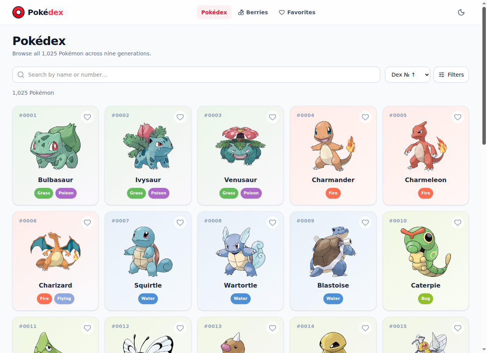
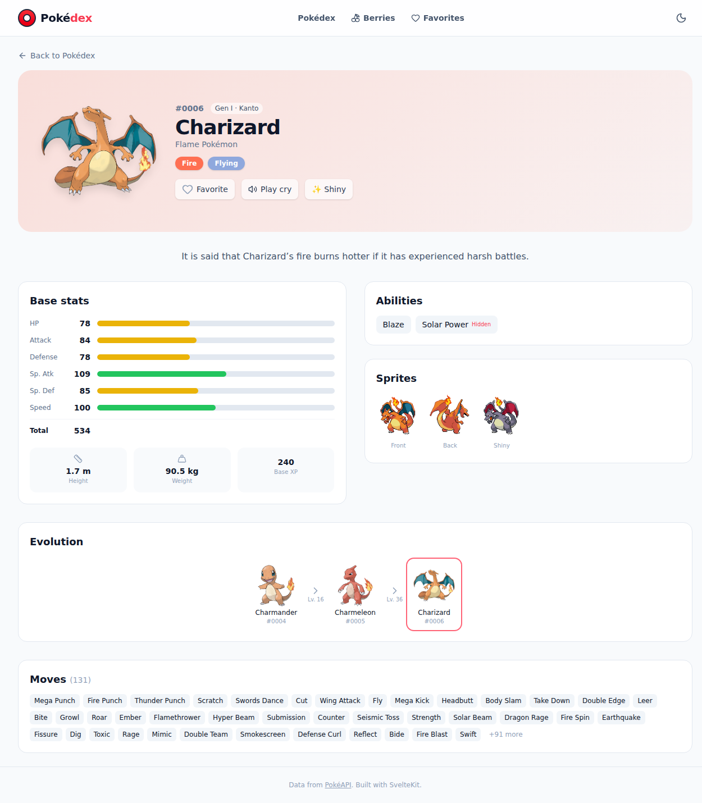
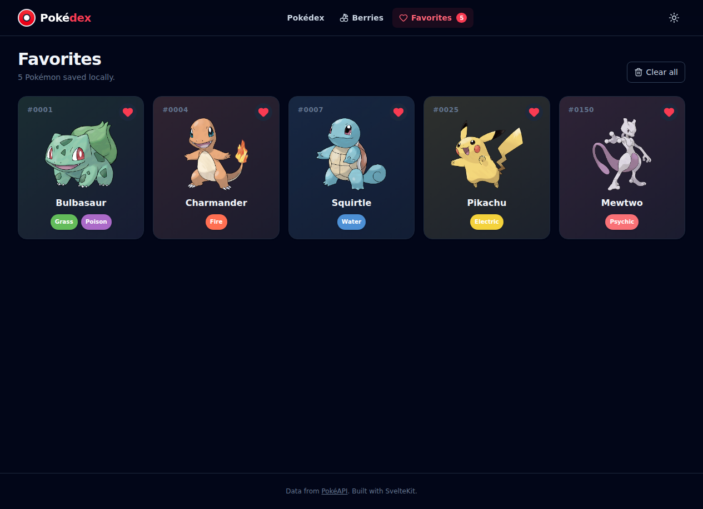
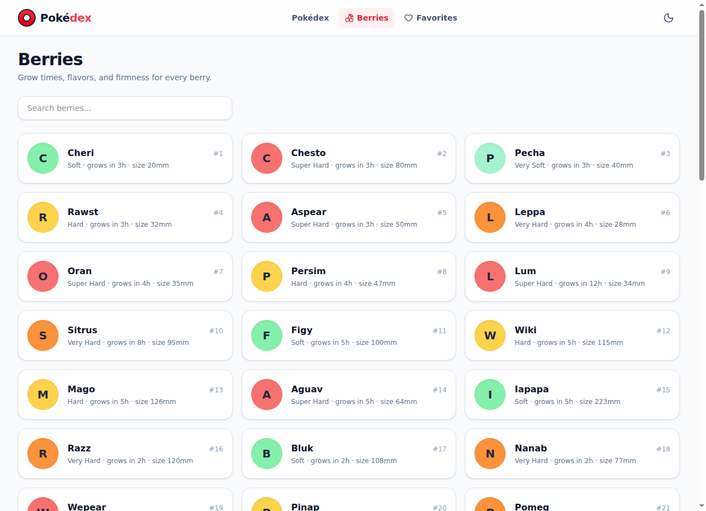
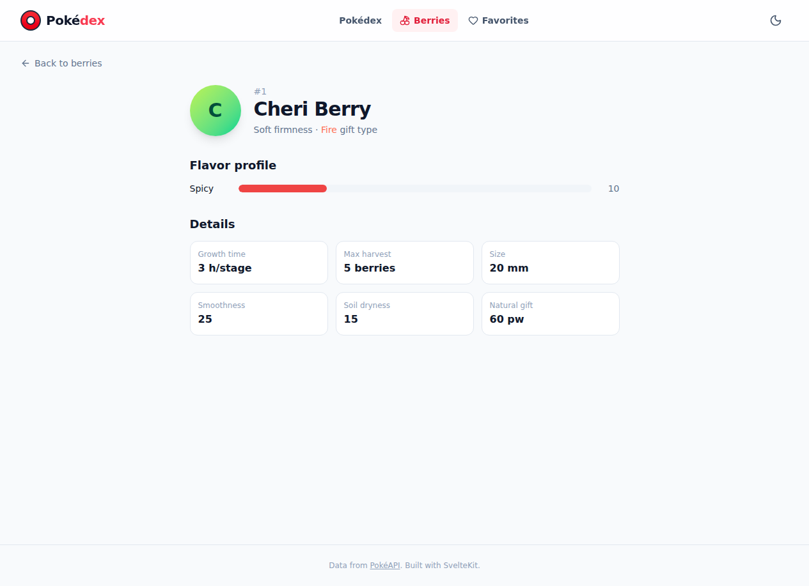

<div align="center">

# 🔴 Pokédex

### A fast, modern Pokédex for all 1,025 Pokémon — built with SvelteKit 5 & the PokéAPI.

[**🌐 Live Demo →**](https://azagatti.github.io/pokedex-tw-opuslo-on-1/)

[](https://github.com/AZagatti/pokedex-tw-opuslo-on-1/actions/workflows/ci.yml) [](https://azagatti.github.io/pokedex-tw-opuslo-on-1/)     

</div>

---



## ✨ Features

- **Full National Dex** — browse all 1,025 Pokémon with buttery **infinite scroll** (IntersectionObserver, 30/page) and shimmer skeletons.
- **Instant search & filters** — debounced name search, filter by **generation** (I–IX) and **type** (multi-select intersection), sort by dex number or name.
- **Rich detail pages** — large official artwork, animated **base-stat bars**, abilities (with hidden-ability tag), full **evolution chain** with level/trigger details, **sprite switcher** (front/back/shiny), and a **play-cry** audio button.
- **Berries encyclopedia** — every berry with firmness, flavor profiles, growth time and size, plus dedicated detail pages.
- **Favorites** — one-tap heart on any card, persisted to `localStorage`, with a dedicated favorites page.
- **Dark mode** — system-aware, class-based, persisted, with `prefers-reduced-motion` support.
- **Accessible & fast** — semantic HTML, ARIA states, keyboard focus rings, and a lean static SPA bundle.

<table>
  <tr>
    <td></td>
    <td></td>
  </tr>
  <tr>
    <td align="center"><em>Detail page with stats & evolution</em></td>
    <td align="center"><em>Favorites — dark mode</em></td>
  </tr>
  <tr>
    <td></td>
    <td></td>
  </tr>
  <tr>
    <td align="center"><em>Berries index</em></td>
    <td align="center"><em>Berry detail with flavor profile</em></td>
  </tr>
</table>

## 🛠 Tech Stack

| Concern       | Choice                                                      |
| ------------- | ----------------------------------------------------------- |
| Framework     | **SvelteKit 2** + **Svelte 5** (runes)                      |
| Language      | **TypeScript** (strict)                                     |
| Styling       | **Tailwind CSS 4** (`@tailwindcss/vite`)                    |
| Icons         | **lucide-svelte**                                           |
| Validation    | **Zod 4** — every API response is schema-validated          |
| Lint / Format | **Ultracite** preset on **oxlint** + **oxfmt** (Rust, fast) |
| Git hooks     | **lefthook** (format + lint pre-commit, check pre-push)     |
| Testing       | **Vitest** (unit) + **Playwright** (e2e)                    |
| Hosting       | **adapter-static** SPA → **GitHub Pages** via Actions       |
| Data          | **PokéAPI** + in-memory `Map` cache (no data-fetching lib)  |

## 🚀 Run locally

```bash
git clone https://github.com/AZagatti/pokedex-tw-opuslo-on-1.git
cd pokedex-tw-opuslo-on-1
npm install
npm run dev          # → http://localhost:5173
```

Other scripts:

```bash
npm run check        # svelte-check (types)
npm run lint         # oxlint
npm run format       # oxfmt --write
npm run test:unit    # vitest
npm run test:e2e     # playwright
npm run build        # static build → build/
```

## 🏗 Architecture (short version)

A **client-rendered SPA** (`ssr = false`) served as static files. Pokémon and berry data are fetched at runtime from the PokéAPI through a thin, typed client (`src/lib/api/`): every response passes through a **Zod schema** and results are memoized in a **URL-keyed `Map` cache** with in-flight de-duplication, so re-visiting a Pokémon is instant and never double-fetches. UI state (favorites, theme, the dex filter pipeline) lives in **Svelte 5 rune stores** (`*.svelte.ts`).

See [`docs/ARCHITECTURE.md`](docs/ARCHITECTURE.md) for data flow, caching and routes, and [`docs/DECISIONS.md`](docs/DECISIONS.md) for why each tool was chosen.

## 📄 License

MIT — data courtesy of [PokéAPI](https://pokeapi.co). Pokémon © Nintendo / Game Freak.
